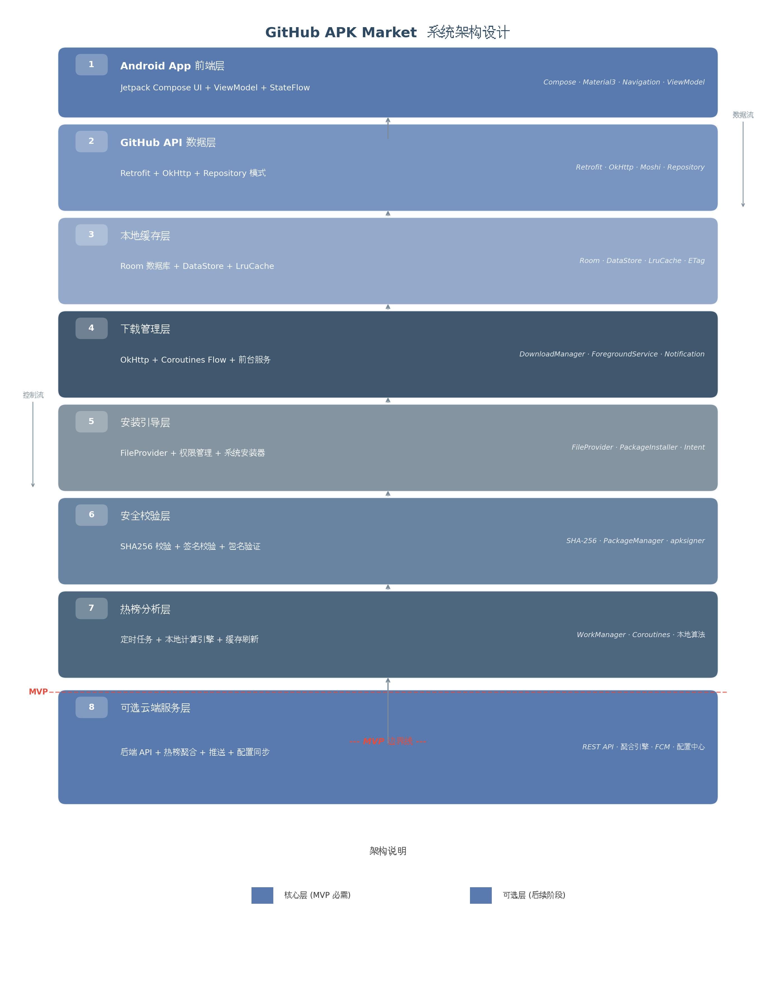

<p align="center">
  
</p>

<h1 align="center">GitMarket</h1>

<p align="center">
  <strong>面向人类移动端与 AI Agent 的 Git Release / Skill / MCP 搜索市场。</strong>
</p>

<p align="center">
  <a href="https://github.com/Harzva/GitReleaseMarket/actions/workflows/build.yml"></a>
  <a href="https://github.com/Harzva/GitReleaseMarket/releases"></a>
  <a href="LICENSE"></a>
  
  
</p>

<p align="center">
  <a href="https://harzva.github.io/GitReleaseMarket/">产品首页</a>
  ·
  <a href="https://harzva.github.io/GitReleaseMarket/app.html">Web 预览</a>
  ·
  <a href="https://harzva.github.io/GitReleaseMarket/mobile-preview.html">移动端预览</a>
  ·
  <a href="https://github.com/Harzva/GitReleaseMarket/releases">下载 Release</a>
  ·
  <a href="SECURITY.md">安全策略</a>
  ·
  <a href="ROADMAP.md">路线图</a>
</p>

GitMarket 不是重新分发 APK 的应用商店，而是一个“Release 市场入口”：搜索开源项目，读取官方 Release，展示资产类型、下载量、上游地址、SHA256 与安全提示，然后把下载动作导回原始发布源。

新的产品方向是 **Human App + Agent Market**：普通用户在移动端/桌面端发现和下载上游 Release；AI Agent 通过 GitMarket Skill / MCP 接口发现仓库、可安装资产、可复用 Skill、MCP Server、许可证和安全证据。

<p align="center">
  
</p>

## 最新发布

`v0.3.5` 重点修复 Android / 移动端真实体验：内置完整 Noto Sans SC 中文字体，避免仓库描述、按钮和状态文本出现方框；重排手机端标题栏、搜索框、结果卡片、Release 资产和下载页指标，避免日期、大小和标签在窄屏竖排挤爆。CI 继续产出 Android APK、iOS simulator、Apple Silicon / Intel macOS、Windows 和 Linux 包。Android 仍只产出一个包：`gitmarket-android-experimental.apk`。

| 产物 | 入口 |
| --- | --- |
| Android experimental APK | [gitmarket-android-experimental.apk](https://github.com/Harzva/GitReleaseMarket/releases/latest) |
| iOS simulator preview | [gitmarket-ios-simulator.zip](https://github.com/Harzva/GitReleaseMarket/releases/latest) |
| Windows 桌面包 | [gitmarket-windows-x86_64.zip](https://github.com/Harzva/GitReleaseMarket/releases/latest) |
| Linux 桌面包 | [gitmarket-linux-x86_64.tar.gz](https://github.com/Harzva/GitReleaseMarket/releases/latest) |
| macOS Apple Silicon 桌面包 | [gitmarket-macos-aarch64.tar.gz](https://github.com/Harzva/GitReleaseMarket/releases/latest) |
| macOS Intel 桌面包 | [gitmarket-macos-x86_64.tar.gz](https://github.com/Harzva/GitReleaseMarket/releases/latest) |
| 在线体验 | [GitHub Pages](https://harzva.github.io/GitReleaseMarket/) |

## 当前进度

| 模块 | 状态 | 说明 |
| --- | --- | --- |
| Web 首页 / Pages | 已上线 | `docs/index.html` 作为宣传页，`docs/app.html` 作为可交互预览，`docs/mobile-preview.html` 作为移动 UI 本地预演 |
| Rust / egui 客户端 | `0.3.5` | Release 发现保持主线，Skill / MCP 广场作为设置中手动开启的能力插件；移动端补齐中文字体兜底和窄屏卡片布局 |
| Android Rust experimental APK | `0.3.5` | 唯一 Android 发布包；使用公开 experimental 测试签名以保持后续覆盖安装能力，不再额外维护 WebView preview APK |
| 桌面包 | 已发布 | Windows / Linux / macOS Apple Silicon / macOS Intel release artifact |
| iOS | SwiftUI 预览版 | `ios/GitMarket` 已提供原生 SwiftUI 壳、搜索台 WebView、安全页、来源页、主题和中英双语；正式 IPA 需要 Apple 签名配置 |
| GitMarket Skill | 初始可用 | `skills/gitmarket-agent-search` 用于 Agent 检索上游 Release、Skill、MCP 与安全证据 |

## Agent Market

GitMarket 参考 [MinishLab/semble](https://github.com/MinishLab/semble) 的 Agent-first README 思路：第一屏直接说明 Agent 价值、接入方式和结果形态。但 GitMarket 的范围不是代码片段检索，而是开源能力市场：

| 层 | 面向对象 | 入口 | 目标 |
| --- | --- | --- | --- |
| Release Market | 人类用户 + Agent | App / Pages / Skill | 找到官方上游 Release、资产、许可证、SHA256、签名和下载链接 |
| Skill Market | Agent | 可选插件 / `skills/gitmarket-agent-search` | 发现可复用工作流，如 UI 预览、README 设计、Android QA |
| MCP Market | Agent 工具链 | 可选插件 / 规划中的 MCP server | 发现可连接能力，如 GitHub、Figma、iOS 构建、Android 测试 |

更多见 [Agent Market 设计说明](docs/AGENT_MARKET.md)。

## 新版 App 方向

这次移动端 UI 不再是单页输入框，而是完整的产品壳：

- **GitMarket 橙绿主题**：默认主题，与新 logo 保持同一套奶油底、橙色搜索、绿色节点和深蓝灰文字。
- **ME Agent 主题**：白底、轻阴影、信息流卡片，参考移动端个人工作台风格。
- **暖色卡片主题**：柔和橙色软件市场视觉，适合轻量应用集合页。
- **清爽蓝白主题**：偏工具型、干净、高对比，适合桌面和浅色系统。
- **橙色发布主题**：偏品牌发布和活动宣传，适合展示新版本与推荐项目。
- **极光深色 / 樱粉产品 / 石墨专业 / 海盐蓝**：新增 4 套主题，分别覆盖深色开发、柔和内容、专业桌面和清爽工具场景。
- **中文 / English**：设置页可切换语言，导航、搜索、下载、安全页均覆盖。

## APK / IPA 本地预览

`docs/mobile-preview.html` 可以直接用浏览器本地打开，用来减少反复安装测试包的次数：

- **HTML 预演模式**：`docs/mobile-preview.html` 只用于提前检查移动端布局、主题、文案和状态，不再产出单独 WebView preview APK。
- **Android Native / iOS Native 模式**：用同一套示例 Release 数据预演移动端原生界面，支持八套主题、中文 / English、底部导航、仓库检查、下载状态和安全页。
- **验收方式**：日常先在 HTML 里检查布局、文案、主题和交互，最终发版前再用真实 Android / iOS 设备做关键路径验收。

## 核心能力

| 能力 | GitHub | Gitee | GitCode |
| --- | --- | --- | --- |
| 仓库 URL 解析 | 支持 | 支持 | 支持 |
| 仓库信息读取 | 支持 | 支持 | 源站跳转兜底 |
| Release 资产读取 | 支持 | 支持 | 源站跳转兜底 |
| 关键词搜索 | 支持 | 支持 | 搜索入口兜底 |
| 默认无关键词展示 | 10 条 | 10 条 | 入口卡片 |
| 搜索结果展示 | 20 条 | 20 条 | 入口卡片 |

支持识别的 Release 资产包括 `.apk`, `.exe`, `.msi`, `.dmg`, `.pkg`, `.AppImage`, `.deb`, `.rpm`, `.ipa`, `.zip`, `.tar.gz`, `.tgz`, `.7z`。

## 安全边界

GitMarket 的底线是透明，不伪装成审核过的商店：

- 不托管、不镜像、不重签第三方二进制。
- 下载链接指向上游官方 Release asset。
- 展示上游仓库、Release 页面、许可证、源代码地址和下载量。
- 下载后计算本地 SHA256；后续将对接上游校验文件和签名指纹。
- GitHub Token 只用于提高 API rate limit；正式移动端应接入系统级凭据存储。
- Android 权限用途必须透明，尤其是网络访问和安装包相关权限。

更多细节见 [SECURITY.md](SECURITY.md)、[PRIVACY.md](PRIVACY.md)、[DISCLAIMER.md](DISCLAIMER.md)。

## 本地开发

Windows 本地编译 Rust 桌面端需要安装 Visual Studio Build Tools，并勾选 **Desktop development with C++**，否则会缺少 `link.exe`。

```bash
cargo fmt
cargo test --locked
cargo clippy --locked --all-targets --all-features -- -D warnings
cargo run --release
```

Android 当前只维护 `gitmarket-android-experimental.apk`，由 GitHub Actions 使用 `cargo-apk` 构建。本地不要求配置 Android 打包环境。

## CI 与发布

`.github/workflows/build.yml` 会在 push、PR 和 tag 上执行：

- `cargo fmt --check`
- `cargo test --locked`
- `cargo clippy --locked --all-targets --all-features -- -D warnings`
- Windows / Linux / macOS Apple Silicon / macOS Intel 桌面构建
- Android Rust experimental APK 构建
- iOS simulator preview 构建

发布新版本：

```bash
git tag v0.3.5
git push origin v0.3.5
```

Tag 构建通过后，GitHub Release 会自动上传桌面包、Android experimental APK、iOS simulator 预览包和 SHA256 文件。

## 路线图

近期重点：

- 让 Rust/egui 客户端稳定通过 CI，产出可试用桌面包和实验 APK。
- 给移动端补截图、录屏 GIF、下载流和安全提示的真实演示。
- 增强 GitCode 接入方式，必要时通过后端代理统一多源搜索协议。
- 增加 Release 缓存、懒加载、Show more 展开和失败重试。
- 把 `gitmarket-agent-search` Skill 做成可安装包，并补真实搜索脚本或服务端 API。
- 设计 GitMarket MCP server：`search_releases`、`search_skills`、`search_mcp_servers`、`inspect_repo`。
- 提取 Android 包签名指纹、权限说明和签名变更提醒。

长期路线：

- 桌面端继续由 Rust/egui 承担。
- Android 正式 MVP 建议使用 Kotlin + Jetpack Compose 重做，以便接入 PackageManager、FileProvider、WorkManager 和系统凭据存储。
- iOS 从 SwiftUI/WebKit preview 开始，签名和 TestFlight 自动化需要 Apple Developer 配置。

## 参与贡献

欢迎提交 Issue、功能建议和 UI 参考。安全问题请不要公开发 Issue，按 [SECURITY.md](SECURITY.md) 私下报告。

```bash
git clone https://github.com/Harzva/GitReleaseMarket.git
cd GitReleaseMarket
cargo fmt
cargo test --locked
```

## License

GitMarket is licensed under GPL-3.0-or-later. See [LICENSE](LICENSE).
